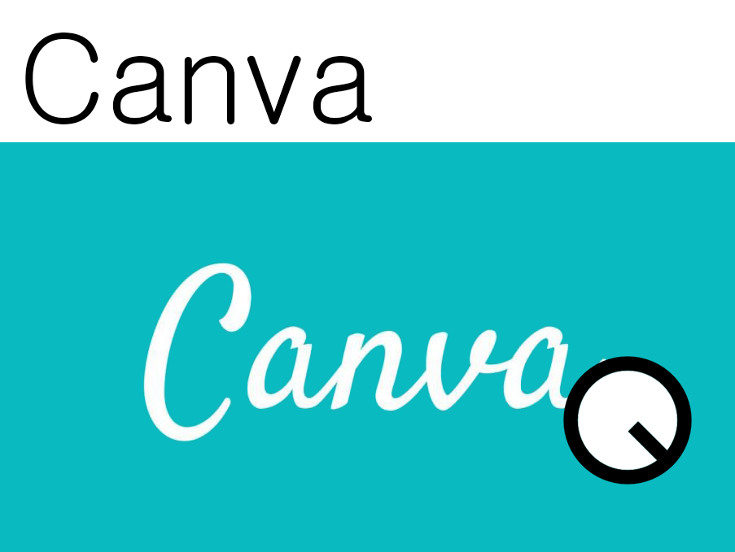

<!--
# TODO: Add Twitch banner

-->

<!--
<table align="center">
  <tr>
    <td>
      
    </td>
    <td>
      
    </td>
  </tr>
</table>
-->

<!--

# Heesu Kim

Heesu Kim is currently a DL/ML[^0] engineer and DL framework developer. He was previously a ship autopilot algorithm engineer but transitioned to the DL world to make up his dream.

## Skills

- Deep learning frameworks[^1],
- Computer vision techniques[^2],
- Data visualization,
- Python(Main), Matlab, C++, ROS[^3],
- Git.

## Work Experience

### Researcher, SNUAILAB, 2023-Present

- Working as part of the deep-learning development team in the AI R&D Center.
- Responsibilities include research and development of deep learning models and frameworks.

### Research associate, Inha University, 2022

- Assisted in developing collision avoidance algorithms for ship autopilot and its implementation on ROS[^3].

### Research assistant, University of Virginia, 2021-2022

- Assisted in designing an evaluation algorithm for surgical performance using RL[^4] and surgery simulator.

### Research assistant, University of Iowa, 2019-2021

- Assisted in serving DMS[^5] that alarms the misuse or improper use of seatbelts.
- Assisted in implementing HPE[^6] module for an ergonomics project that measures the risk of workers' injury at the field.

### Internship, KRISO[^7], 2017-2018

- Assisted in the management and maintenance of ship autopilot systems composed of multiplex AI and automation systems.

## Education

- Master of Engineering, Naval Architecture and Ocean Engineering, Inha University, Korea, 2019, _Thesis title: [Local path planning for autopilot of ship with quaternion ship domain(Korean)](https://inha.primo.exlibrisgroup.com/discovery/fulldisplay?docid=alma991009103061005086&context=L&vid=82KST_INH:INHA&lang=ko&search_scope=MyInst_and_CI&adaptor=Local%20Search%20Engine&tab=Everything&query=any,contains,%EA%B9%80%ED%9D%AC%EC%88%98&offset=0)_
- Master of Philosophy, Naval Architecture & Ocean and Marine Engieering, University of Strathclyde, United Kingdom, 2018, _Thesis title: [Stereo vision-based object detection algorithm for USV using faster R-CNN](https://stax.strath.ac.uk/concern/theses/4b29b6075)_
- Bachelor of Engineering, Naval Architecture and Ocean Engineering, Inha University, Korea

## Projects

### Waffle: Adaptive deep learning framework (Current)

In this project, we are looking to the specialized training platform focusing on the "Adaptive".

[[waffle_hub(Github.com)](https://github.com/snuailab/waffle_hub)]
[[waffle_utils(Github.com)](https://github.com/snuailab/waffle_utils)]

### Evaluating surgical performance using reinforcement learning (2022)

This project aims to study the capability of AI to score surgical performance, which replaces the manual scoring from experts.

### System and method for monitoring occupants within a vehicle using a plurality of convolutional nerual network (2021)

This Project aims to develop a classification model to detect proper, imporper, and non-use of the seatbelt in vehicles through vision processing thereby using deep learning

### Ergonomics assessment for workers' safe (2020)

This project aims to establish a workflow to assess the workers' injury risk on the top of the automation that estimates their pose.

### Stereo vision-based object detection algorithm for USV[^8] using faster R-CNN[^9] (2018) 

This project aims to detect other ships in the ocean and estimate the distance to them.

[[Stax.Strath.ac.uk](https://stax.strath.ac.uk/concern/theses/4b29b6075)]
[[Youtube.com](https://www.youtube.com/watch?v=c9i-GPGj5B8)]

### Collision avoidance implementation on ROS (2022)

This project aims to implement ship collision avoidance algorithm on ROS[^3]

### Local path planning for ship autopilot with quaternion ship domain (2019)

This project aims to develop a collision avoidance algorithm for ship autopilot.

[[Inha.Primo.exlibrisGroup.com(Korean)](https://inha.primo.exlibrisgroup.com/discovery/fulldisplay?docid=alma991009103061005086&context=L&vid=82KST_INH:INHA&lang=ko&search_scope=MyInst_and_CI&adaptor=Local%20Search%20Engine&tab=Everything&query=any,contains,%EA%B9%80%ED%9D%AC%EC%88%98&offset=0)]
[[Github.com](https://github.com/oneQuery/ship-local-path-planning)]
[[Youtube.com](https://www.youtube.com/watch?v=jqptI6XHtwA)]

### A study on path optimization method of an USV[^8] under environmental loads using GA[^10] (2017) 

This project aims to optimize the route for USV to minimize the fuel time cost.

[[ScienceDirect.com](https://www.sciencedirect.com/science/article/abs/pii/S0029801817304122)]
[[Github.com](https://github.com/oneQuery/shipPathOptimization)]
[[Youtube.com](https://www.youtube.com/watch?v=k9u-QVia5hc)]

## Publications
- [**Kim, H.**, Kim, S.H., Jeon, M., Kim, J., Song, S. and Paik, K.J., "A study on path optimization method of an unmanned surface vehicle under environmental loads using genetic algorithm", Ocean Engineering, 2017](https://doi.org/10.1016/j.oceaneng.2017.07.040)
- [Jeon, M.R., **Kim, H.S.**, Kim, J.H., Kim, S.J., Song, S.S. and Kim, S.H., "A study on the dynamic positioning control algorithm using fuzzy gain scheduling PID control theory", Journal of the Society of Naval Architects of Korea, 2017](http://dx.doi.org/10.3744/SNAK.2017.54.2.102)
- [Song, S.S., Kim, S.H., **Kim, H.S.** and Jeon, M.R., "A study on the feedforward control algorithm for dynamic positioning system using ship motion prediction", Journal of the Korean Society of Marine Environment & Safety, 2016](https://doi.org/10.7837/kosomes.2016.22.1.129)

## Conference Publications
- Heesu Kim, Sehyun Chun, Stephen Baek. “Detecting Adequate Use of a Seat Belt for Driver Monitoring System”, Research Open House (Virtual), 2020, University of Iowa, USA
- Heesu Kim, Evangelos Bolourouris, Sanghyun Kim, “Object Detection Algorithm for Unmanned Surface Vehicle using Faster R-CNN”, WMTC[^12], 2018, Shanghai, China
- Heesu Kim, Sanghyun Kim. “A Study on Heave and Pitch Motion Control of Fully-Submerged Hydrofoil using Deep Q-Network”, General Meeting and Annual Autumn Conference of the Society of Naval Architects of Korea, 2018, Changwon, Republic of Korea
- Heesu Kim. “A study on dynamic obstacle avoidance for Unmanned Surface Vehicle using Deep Q-Network”, PAAMES / AMEC[^13], 2018,  BEXCO, Busan, Republic of Korea Joint Symposium, ICC JEJU, Jeju, Republic of Korea
- Heesu Kim, Evangelos Boulougouris. “A study on algorithm of vision-based real-time object recognition for USV using Faster R-CNN”, KAOSTS[^14], 2018, Republic of Korea
- Heesu Kim, Evangelos Boulougouris. “Vision based collision risk for Unmanned Surface Vehicle using Faster Region based Convolutional Neural Network”, EKC[^15], 2017, Stockholm, Sweden
- Heesu Kim, Sanghyun Kim. “A study on optimized path selection algorithm for unmanned surface vehicles under ocean environmental loads”, ANC[^16], 2016, Yeosu Expo, Yeosu, Republic of Korea
- Heesu Kim, Sanghyun Kim. “A study on optimized path selection algorithm for unmanned surface vehicles under ocean environmental loads”, KAOSTS[^17] Joint Symposium, 2016, BEXCO, Busan, Republic of Korea
- Heesu Kim, Soonseok Song, Maro Jeon, Sanghyun Kim. “A study on the feedforward control algorithm for dynamic positioning system using ship motion prediction”,
ISFT[^18], 2016, Harbin, China

## Contact

[heesu-kim@snuailab.ai]
[[DeepErGo(Youtube.com)]([Youtube.com/@deepergo](https://www.youtube.com/@deepergo))]

[^0]: Deep Learning / Machine Learning
[^1]: Pytorch(Main), Keras, Tensorflow
[^2]: Object detection, Image classification, Human pose estimation
[^3]: Robot Operating System
[^4]: Reinforcement Learning
[^5]: Driver Monitoring System
[^6]: Human Pose Estimation
[^7]: Korea Research Institute of ships and Ocean Engineering
[^8]: Unmanned Surface Vehicle
[^9]: Region-based Convolutional Neural Network
[^10]: Genetic Algorithm
[^11]: Ocean Engineering
[^12]: World Maritime Technology Conference
[^13]: Advanced Maritime Engineering Conference Concurrently with Pan Asian Association of Maritime Engineering societies
[^14]: The Korean Association of Ocean Science and Technology Societies
[^15]: Europe-Korea Conference on Science and Technology
[^16]: Asia Navigation Conference
[^17]: The Korean Association of Ocean Science and Technology Societies
[^18]: International Symposium on Fusion Tech

-->
